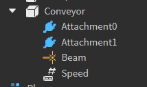

Conveyors are a part that moves the player along with them, like a conveyor belt. They are a normal [Part](https://create.roblox.com/docs/reference/engine/classes/Part) with a beam particle and an [IntValue](https://create.roblox.com/docs/reference/engine/classes/IntValue) parented to them.
The `IntValue` is used to control the speed of the conveyor. The higher the value, the faster the conveyor goes.

**Rig:**

**Requirements**

- The beam particle *must* be the one that's provided in the example below or the creator's kit. Custom beam particles are not allowed at this time.
- The conveyor must have a tag of "Conveyor"

**Example** : [ExampleConveyor.rbxm](../Assets/ObstacleExamples/ExampleConveyor.rbxm)