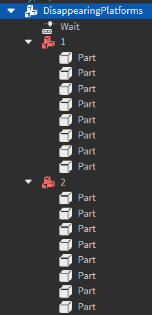

Disappearing platform sequences are a [Model](https://create.roblox.com/docs/reference/engine/classes/Model) containing numbered sub-`model`s, which contain sets of [Part](https://create.roblox.com/docs/reference/engine/classes/Part)s that disappear and reappear in an ordered sequence, with a [NumberValue](https://create.roblox.com/docs/reference/engine/classes/NumberValue) parented to the root which controls the delay between appearing and disappearing.

The sets of parts will appear and disappear in numerical order, with `1` appearing & disappearing first, then `2` appearing, etc until the end of the sequence.

**Rig:**

**Requirements**

- The disappearing platform sequence must have a tag of "DisappearingPlatforms"
- The disappearing platform sequence must contain at least one sequence model
- The sequence models must be named a number, and must be in numerical order (e.g. you cannot have only `1` and `3`, there must be a `2` present as well)
- The platform parts cannot have any textures applied to them, the textures will be applied at runtime by the game
- The platform parts must have a partshape of `Block`

**Example** : [ExampleDisappearingPlatforms.rbxm](../Assets/ObstacleExamples/ExampleDisappearingPlatforms.rbxm)