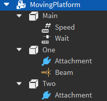

Moving platforms are a [Model](https://create.roblox.com/docs/reference/engine/classes/Model) containing a [Part](https://create.roblox.com/docs/reference/engine/classes/Part) that moves between two node [Part](https://create.roblox.com/docs/reference/engine/classes/Part)s. The main platform part contains an [IntValue](https://create.roblox.com/docs/reference/engine/classes/IntValue) to control the platform's speed, and a [NumberValue](https://create.roblox.com/docs/reference/engine/classes/NumberValue) to control the delay between move.

**Rig:**

**Requirements:**

- The moving platform's model must have a tag of "MovingPlatform"
- The two node parts must be anchored and invisible
- The two node parts cannot move (e.g. they cannot be a projectile)
- The primary platform part must be anchored, it will be unanchored at runtime by the game
- The primary platform cannot be moved by another obstacle (e.g. they cannot be a projectile)
- The beam particle from the example *must* be present in the model and linking the two nodes together
- The first node part must be named "One"
- The second node part must be named "Two"

**Example:** [ExampleMovingPlatforms.rbxm](../Assets/ObstacleExamples/ExampleMovingPlatforms.rbxm)