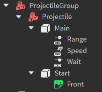

Projectile groups are a [Model](https://create.roblox.com/docs/reference/engine/classes/Model) containing sub-`model`s, which contain a [BasePart](https://create.roblox.com/docs/reference/engine/classes/BasePart) that is created at a point, and then translated away in a specific direction at a certain speed for some time. The delay before firing, the projectile speed and how far it goes (in studs) are determined by [NumberValue](https://create.roblox.com/docs/reference/engine/classes/NumberValue) instances parented to the primary projectile part.

**Rig:**

**Requirements:**

- The projectilegroup model must have a tag of "ProjectileGroup"
- The projectiles inside of the projectilegroup model must have a [BasePart](https://create.roblox.com/docs/reference/engine/classes/BasePart) named "Start". This part must be anchored and must be CFramed to face the direction you want the projectile to move in.
- The projectile must be named "Main"
- The projectile must be anchored

**Example:** [ExampleProjectiles.rbxm](../Assets/ObstacleExamples/ExampleProjectiles.rbxm)