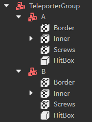

Teleporter groups are a [Model](https://create.roblox.com/docs/reference/engine/classes/Model) containing a set of sub-`model`s that represent nodes in the teleporter group.

Nodes have different modes that can be configured with attributes. The two modes are `Sender` and `Receiver`.
If a node is configured as a `Sender`, it must have an additional attribute named `DestinationName`. The `DestinationName`'s value must exactly match the name of another node model in the teleportergroup. Upon being touched by a player, the player will be teleported to the destination node.
If a node is configured as a `Receiver`, it will simply do nothing upon being touched by a player.

Two-way teleports are supported. If a `Sender` sends the player to another `Sender`, the receiving sender will be disabled until the player steps off of the node.

**Rig:**

**Requirements:**

- Teleporter nodes *must* be copied from the creator's kit. Custom-built teleporter nodes are not allowed at this time.
- Teleporter nodes must be anchored
- Teleporter nodes cannot move (e.g. they cannot be a projectile)

**Example:** [ExampleTeleporterGroup.rbxm](../Assets/ObstacleExamples/ExampleTeleporterGroup.rbxm)