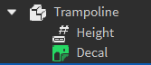

Trampolines are a [BasePart](https://create.roblox.com/docs/reference/engine/classes/BasePart) that bounces the player upwards upon being stepped on. The height that the player is bounced is configured by a [IntValue](https://create.roblox.com/docs/reference/engine/classes/IntValue) parented to the trampoline's part.

**Rig:**

**Requirements:**

- Trampolines must be copied from the creator's kit. Custom trampoline shapes / models are not allowed at this time

**Example:** [ExampleTrampoline.rbxm](../Assets/ObstacleExamples/ExampleTrampoline.rbxm)