!!! Note
	We are only accepting `Easy` sections at this time!

Different section difficulties have different standards. These standards are how we quantify what the difficulty of a section is. The standards apply in a top-down fashion, from harder difficulty to easier difficulty. For example, if hard sections have a standard saying "conveyors cannot have a speed value above 40", then that standard would apply to hard sections and all difficulties below hard (such as medium).

## Impossible and below
- The developers must be able to beat the section consistently given practice
- Avoid artificial difficulty! Some examples of artificial difficulty include:
	- Super thin platforms (like 1x1x1 studs,)
	- Tricking the player by adding kill parts they won’t be able to see, non-collidable platforms that are fully opaque
	- Obstacles that can only be overcome by abusing glitches or requiring certain avatar sizes
- In `Impossible` sections only, obstacles must require precise timing of your avatar's movements
- The section must play and flow like a "platformer" level, not a roblox obby or flood escape 2 level
- Platforms must have a minimum standing width of 10x10 studs, and a minimum height of 1 stud

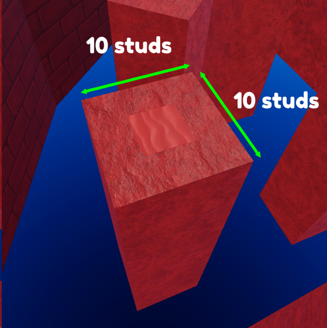{: style="height:250px;width:250px"}

- Shortcuts / multiple routes are allowed and encouraged, they should be slightly harder than the difficulty they are in, for example if a major shortcut appears in an easy section, it should be medium. In the example below, players are able to go left or right, with the right side being the shortcut:

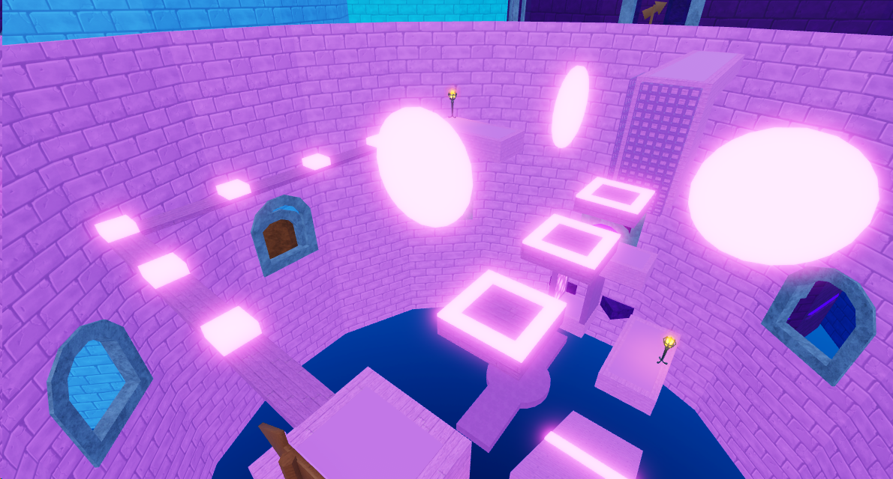

- We permit courses that go outside their section using teleporters, these course models CANNOT exceed the height of their parent section. If the section walls are 500 studs high, the height of the part outside the section should be a maximum of 500 studs as well!

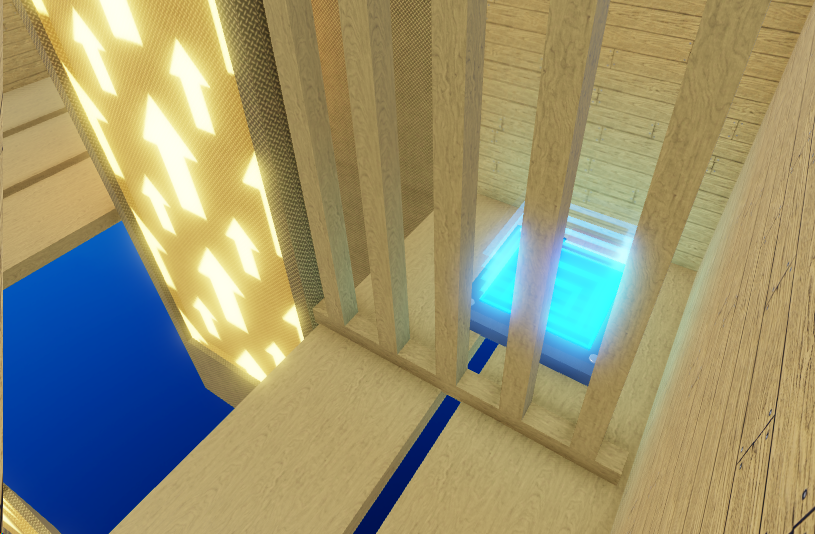{: style="height:250px;width:350px"}
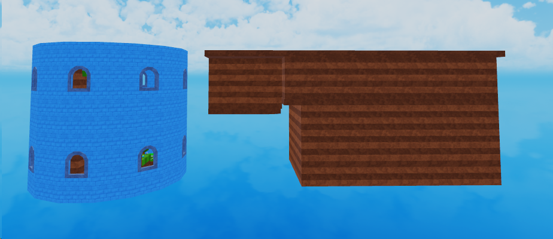{: style="height:250px;width:350px"}

- Similar to above, we allow SECRET shortcuts that go outside the tower, the idea is that you hide a teleporter somewhere in the course that takes the player outside the section to a course that is 1-2 tier(s) higher in difficulty than the parent section, but is able to be completed much faster with skill. For example, a secret course inside an easy section should be medium to hard. The teleporter to the secret should be well hidden!

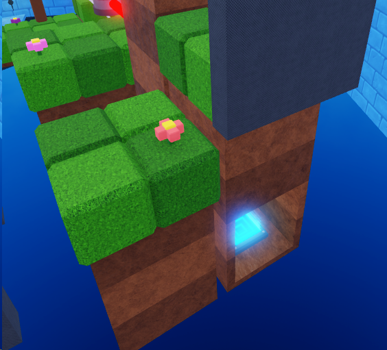{: style="height:250px;width:350px"}
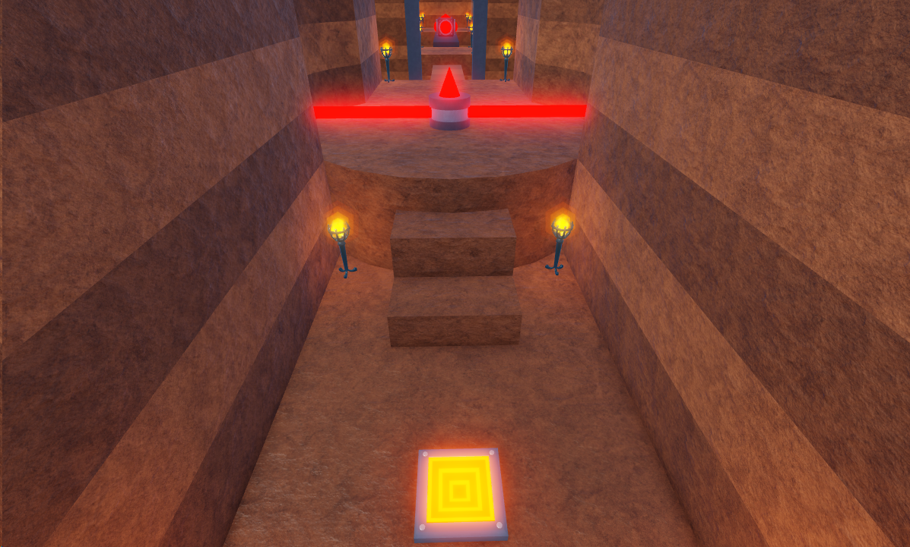{: style="height:250px;width:350px"}

- No damage parts directly on top of ladders and fences, you must add a barrier between the top of the ladder/fence and the damage part if you want one on top:

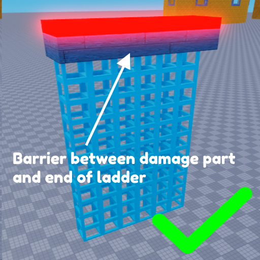{: style="height:250px;width:250px"}
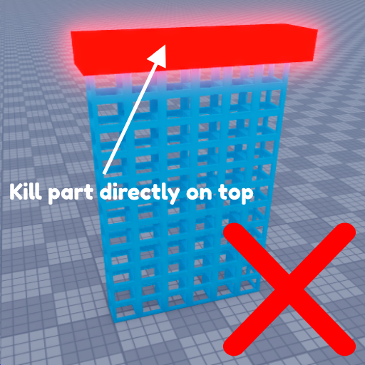{: style="height:250px;width:250px"}

## Rage inducing and below
- Obstacles must have a noticably slower speed than obstacles found in `Impossible` sections
- The section must be the size of a "standard" section, smaller than roughly half of a large `Impossible` section

## Hard and below
- Obstacles can't require strict / precise timing of movements IF that results in the player falling (being damaged for failure of precise movements is OK)
- The section's segments connecting the stationary / "rest" platforms must be shorter in length than those found in `Rage inducing` sections
- The section's segments connecting the stationary / "rest" platforms must have a noticably lower chance of making the player fall than those found in `Rage inducing` sections

## Medium and below
- The player should be guided on where to go (e.g. signs pointing to the easiest possbile paths), the level flow should be noticably linear

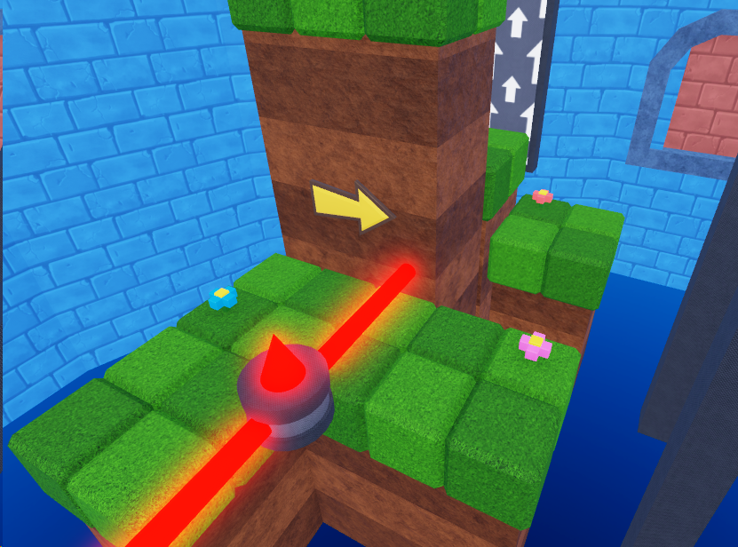{: style="height:250px;width:450px"}

- The player should not be required to do complex movements (e.g. doublejumping in midair underneath a barrier to get to the other side of it)
- Obstacles should be noticably slower than obstacles found in `Hard` sections
- Any danger present (falling, getting hurt, etc) should be easily avoidable to a novice player

## Easy and below
- If ice is present, it cannot require precision of movement
- Obstacle types cannot be combined, they must be standalone. This should be kept simple as we are trying to introduce players to obstacles rather than really challenge them. 

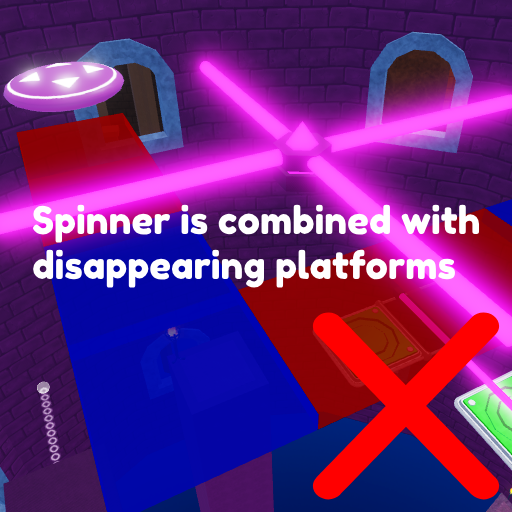{: style="height:250px;width:250px"}
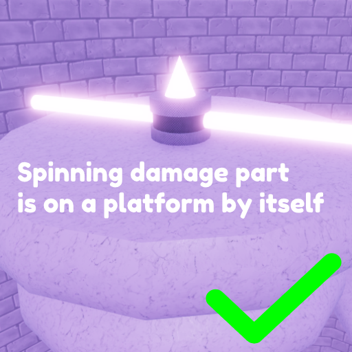{: style="height:250px;width:250px"}

- Walljumps should have a platform underneath them to catch players from falling

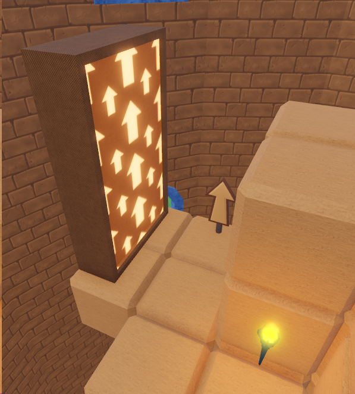{: style="height:250px;width:250px"}
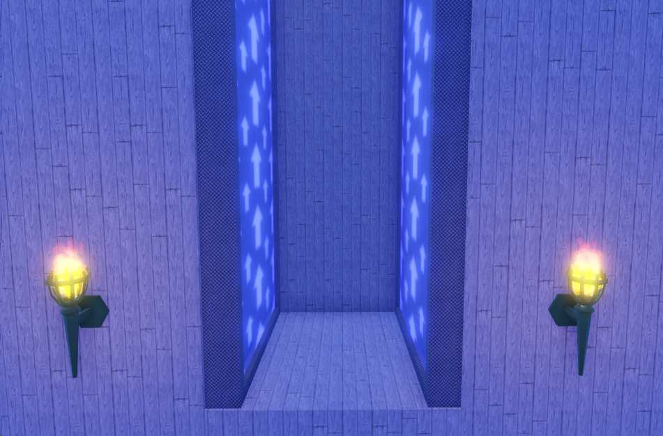{: style="height:250px;width:250px"}

- Obstacles should be noticably slower than those found in `Medium` sections
- Any danger present (falling, getting hurt) should be easily avoidable to new players with minimal experience in the game

## Cakewalk
- There should be NO danger of falling too far back in the section. Falling should at most make the player lose a few seconds of their time
- Any fall hazards should not also hurt the player upon landing (e.g. player should not be able to fall into a lava pit with a harder escape)
- Any danger (falling, getting hurt) should be avoidable by players with absolutely no experience in the game
- The section should be designed like that of an intro mario level - big platforms, a fun linear level flow, barely "tower" like (external section segments via teleporters are a great use here!)
- The section should introduce players to most mechanics in the game (obstacles and avatar movement)

