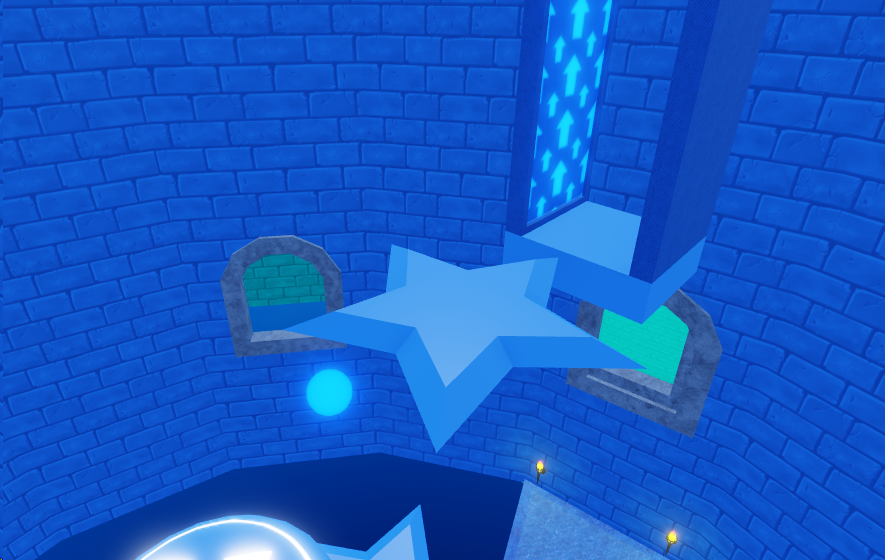
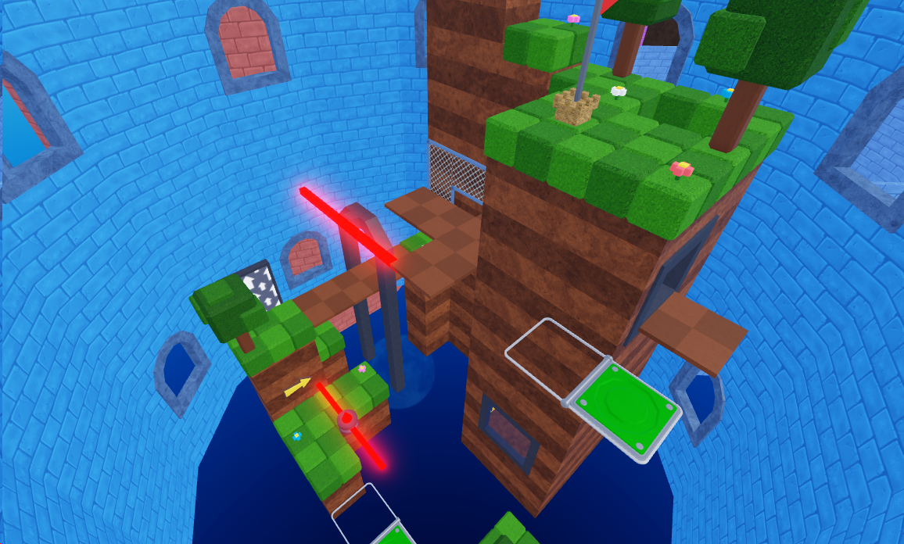

# Artstyle standards

Super Skyward Towers has a very simplistic art style, we use standard Roblox materials and very few custom textures save for section walls.

- Try to use slightly lighter colors for platforms than section walls if they are the same color, this way things are not hard to see for players. Sections do not have to use all of the same color! Both images below are good examples!

{: style="height:250px;width:350px"}
{: style="height:250px;width:350px"}