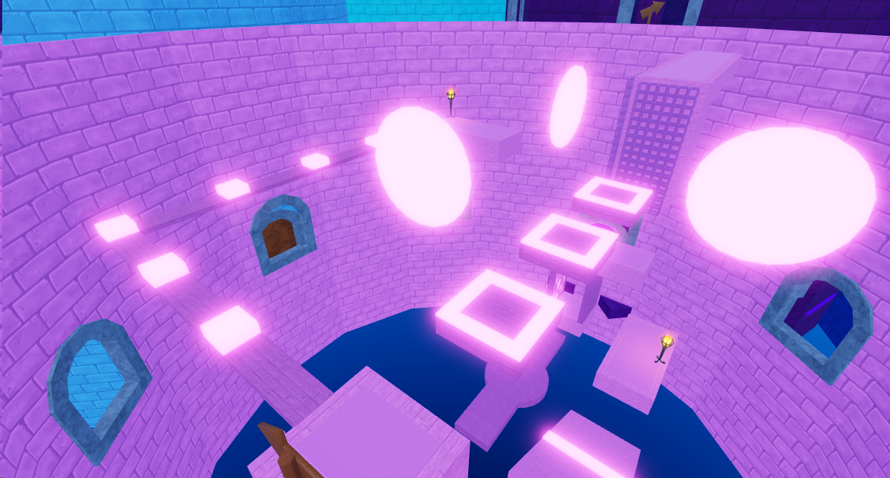
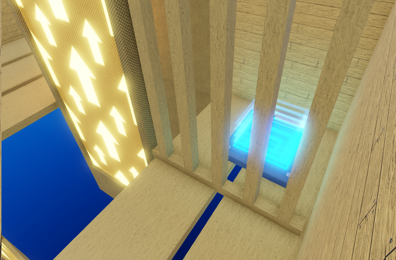
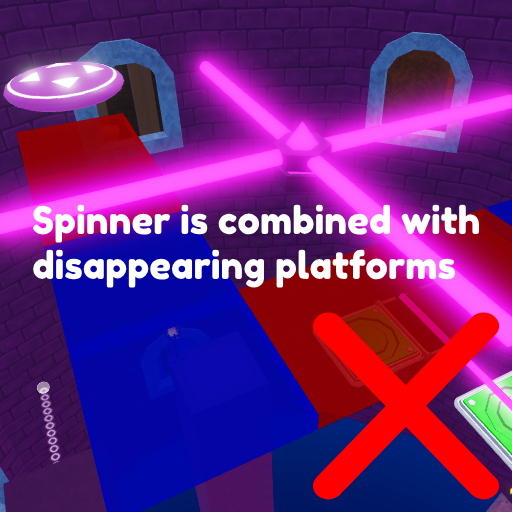
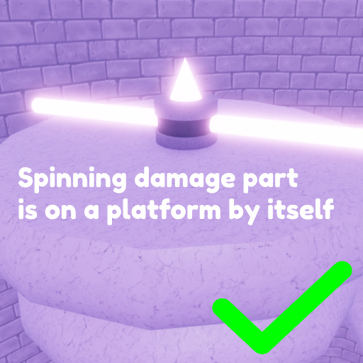

!!! Note
	We are only accepting `Easy` sections at this time!

## Design standards

- Avoid artificial difficulty! Some examples of artificial difficulty include:
	- Super thin platforms (like 1x1x1 studs,)
	- Tricking the player by adding kill parts they won’t be able to see, non-collidable platforms that are fully opaque
	- Obstacles that can only be overcome by abusing glitches or requiring certain avatar sizes

- Shortcuts / multiple routes are allowed and encouraged, they should be slightly harder than the difficulty they are in, for example if a major shortcut appears in an easy section, it should be medium. In the example below, players are able to go left or right, with the right side being the shortcut:

- Players should be directed with arrow signs towards the easiest path available, arrows matter the most in `Easy` and `Medium` tiered sections:

{: style="height:250px;width:450px"}

- We permit courses that go outside their section using teleporters, these course models CANNOT exceed the height of their parent section. If the section walls are 500 studs high, the height of the part outside the section should be a maximum of 500 studs as well!

{: style="height:250px;width:350px"}
{: style="height:250px;width:350px"}

- Similar to above, we allow SECRET shortcuts that go outside the tower, the idea is that you hide a teleporter somewhere in the course that takes the player outside the section to a course that is 1-2 tier(s) higher in difficulty than the parent section, but is able to be completed much faster with skill. For example, a secret course inside an easy section should be medium to hard. The teleporter to the secret should be well hidden!

{: style="height:250px;width:350px"}
{: style="height:250px;width:350px"}

- No damage parts directly on top of ladders and fences, you must add a barrier between the top of the ladder/fence and the damage part if you want one on top:

{: style="height:250px;width:250px"}
{: style="height:250px;width:250px"}

## Easy standards

Easy sections act as a safe way to introduce players to the mechanics of Super Skyward Towers. It is important that they follow a logical flow of progression such that the player learns and does not become too frustrated. As such, these sections are the **most important** sections of the game.

- Try not to overwhelm the player by combining too many obstacles of different types together, keep things simple as we are trying to introduce players to obstacles rather than really challenge them. Example shown below:

{: style="height:250px;width:250px"}
{: style="height:250px;width:250px"}

- Wall jumps should usually have a platform underneath to catch players, as shown below:

{: style="height:250px;width:250px"}
{: style="height:250px;width:250px"}

- Spinners should not be too fast, an AngularVelocity for their HingeConstraint of 0.7 - 1.1 is a good range.
- Moving platforms should not be too fast, a speed of 12 - 18 is a good range
- Conveyors should not be too fast, usually a speed of 15 - 27 is a good range
- Disappearing platforms should not disappear too fast, usually a 2 - 2.5 second wait-time is a good range

- Regular platforms should have a minimum standing width of 10x10 studs, and a minimum height of 1 stud. Try and give players lots of ground to stand on in easy sections:

{: style="height:250px;width:250px"}

## Artstyle standards

Super Skyward Towers has a very simplistic art style, we use standard Roblox materials and very few custom textures save for section walls.

- Try to use slightly lighter colors for platforms than section walls if they are the same color, this way things are not hard to see for players. Sections do not have to use all of the same color! Both images below are good examples!

{: style="height:250px;width:350px"}
{: style="height:250px;width:350px"}