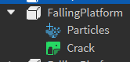

# Conveyor

Conveyors are a part that moves the player along with them, like a conveyor belt. They are a normal [Part](https://create.roblox.com/docs/reference/engine/classes/Part) with a beam particle and an [IntValue](https://create.roblox.com/docs/reference/engine/classes/IntValue) parented to them.
The `IntValue` is used to control the speed of the conveyor. The higher the value, the faster the conveyor goes.

Requirements:
- The beam particle *must* be the one that's provided in the example below. Custom beam particles are not allowed at this time.
- The conveyor must have a tag of "Conveyor"

Rig:

Example : [ExampleConveyor.rbxm](./Assets/ObstacleExamples/ExampleConveyor.rbxm)

# Damage part

Damage parts are a normal [BasePart](https://create.roblox.com/docs/reference/engine/classes/BasePart) that deals damage to a player if their hitbox comes into contact with it.

Requirements:
- The damage part must have a tag of "DamagePart"
- The damage part must not have any textures applied to it, the animated damage textures will be added at runtime by the game
- The damage part must have a transparency of 0
- The damage part must have a material of `Neon`

Example : [ExampleLava.rbxm](./Assets/ObstacleExamples/ExampleLava.rbxm)

# Disappearing platforms

Disappearing platforms are a [Model](https://create.roblox.com/docs/reference/engine/classes/Model) containing numbered sub-`model`s, which contain sets of [Part](https://create.roblox.com/docs/reference/engine/classes/Part)s that disappear and reappear in an ordered sequence, with a [NumberValue](https://create.roblox.com/docs/reference/engine/classes/NumberValue) parented to the root which controls the delay between appearing and disappearing.

Rig:

Requirements:
- The disappearing platform sequence must have a tag of "DisappearingPlatforms"
- The disappearing platform sequence must contain at least one sequence model
- The platform parts cannot have any textures applied to them, the textures will be applied at runtime by the game
- The platform parts must have a partshape of `Block`

Example : [ExampleDisappearingPlatforms.rbxm](./Assets/ObstacleExamples/ExampleDisappearingPlatforms.rbxm)

# Falling platforms

Falling platforms are a [Part](https://create.roblox.com/docs/reference/engine/classes/Part) with a beam particle and a crack decal that shakes & falls upon being stepped on by a player with a particle and texture parented to them. The delay before falling & speed of the fall cannot be custom-defined at this time.

Rig:

Requirements:
- The falling platform must have a tag of "FallingPlatform"
- The texture & particles *must* be the ones that are provided in the example below. Custom particles & crack textures are not allowed at this time.
- The particle must match the color of the falling platform.
- Falling platforms must be anchored
- Falling platforms cannot be moved (e.g. they cannot be a projectile)

Example : [ExampleFallingPlatforms.rbxm](./Assets/ObstacleExamples/ExampleFallingPlatforms.rbxm)

# Moving platforms

Moving platforms are a [Model](https://create.roblox.com/docs/reference/engine/classes/Model) containing a [Part](https://create.roblox.com/docs/reference/engine/classes/Part) that moves between two node [Part](https://create.roblox.com/docs/reference/engine/classes/Part)s. The main platform part contains an [IntValue](https://create.roblox.com/docs/reference/engine/classes/IntValue) to control the platform's speed, and a [NumberValue](https://create.roblox.com/docs/reference/engine/classes/NumberValue) to control the delay between move.

Rig:

Requirements:
- The moving platform's model must have a tag of "MovingPlatform"
- The two node parts must be anchored and invisible
- The two node parts cannot move (e.g. they cannot be a projectile)
- The primary platform part must be anchored, it will be unanchored at runtime by the game
- The primary platform cannot be moved by another obstacle (e.g. they cannot be a projectile)
- The beam particle from the example *must* be present in the model and linking the two nodes together
- The first node part must be named "One"
- The second node part must be named "Two"

Example : [ExampleMovingPlatforms.rbxm](./Assets/ObstacleExamples/ExampleMovingPlatforms.rbxm)

# Projectiles

Projectiles are a [Model](https://create.roblox.com/docs/reference/engine/classes/Model) containing sub-`model`s, which contain a [BasePart](https://create.roblox.com/docs/reference/engine/classes/BasePart) that is created at a point, and then translated away in a specific direction at a certain speed for some time. The delay before firing, the projectile speed and how far it goes (in studs) are determined by [NumberValue](https://create.roblox.com/docs/reference/engine/classes/NumberValue) instances parented to the primary projectile part.

Rig:

Requirements:
- The projectilegroup model must have a tag of "ProjectileGroup"
- The projectiles inside of the projectilegroup model must have a [BasePart](https://create.roblox.com/docs/reference/engine/classes/BasePart) named "Start". This part must be anchored and must be CFramed to face the direction you want the projectile to move in.
- The projectile must be named "Main"
- The projectile must be anchored

Example : [ExampleProjectiles.rbxm](./Assets/ObstacleExamples/ExampleProjectiles.rbxm)

# Spinners

Spinners are a [Model](https://create.roblox.com/docs/reference/engine/classes/Model) containing a [physics assembly](https://create.roblox.com/docs/physics/assemblies) that relies on [HingeConstraint](https://create.roblox.com/docs/reference/engine/classes/HingeConstraint)s to keep the assembly together & spinning. Unlike most obstacles, spinners have no structure requirements, other than the root being a model, and there being at least one `HingeConstraint` existing as a descendent of the model.

Requirements:
- The spinner's model must have a tag of "SpinnerRig"

Example : [ExampleSpinners.rbxm](./Assets/ObstacleExamples/ExampleSpinners.rbxm)

# Switch panels

Switch panels are a [Model](https://create.roblox.com/docs/reference/engine/classes/Model) with a `PrimaryPart`, which contains a [HingeConstraint](https://create.roblox.com/docs/reference/engine/classes/HingeConstraint) to flip its associated [physics assembly](https://create.roblox.com/docs/physics/assemblies) back and forth when a player performs a singlejump.

Requirements:
- Custom switch panels are not allowed at this time. The switch panel from the creator's kit *must* be used.

Example : [ExampleSwitchPanel.rbxm](./Assets/ObstacleExamples/ExampleSwitchPanel.rbxm)

# Teleporter group

Teleporter groups are a [Model](https://create.roblox.com/docs/reference/engine/classes/Model) containing a set of sub-`model`s that represent nodes in the teleporter group.

Nodes have different modes that can be configured with attributes. The two modes are `Sender` and `Receiver`.
If a node is configured as a `Sender`, it must have an additional attribute named `DestinationName`. The `DestinationName`'s value must exactly match the name of another node model in the teleportergroup. Upon being touched by a player, the player will be teleported to the destination node.
If a node is configured as a `Receiver`, it will simply do nothing upon being touched by a player.

Two-way teleports are supported. If a `Sender` sends the player to another `Sender`, the receiving sender will be disabled until the player steps off of the node.

Rig:

Requirements:
- Teleporter nodes *must* be copied from the creator's kit. Custom-built teleporter nodes are not allowed at this time.
- Teleporter nodes must be anchored
- Teleporter nodes cannot move (e.g. they cannot be a projectile)

Example : [ExampleTeleporterGroup.rbxm](./Assets/ObstacleExamples/ExampleTeleporterGroup.rbxm)

# Trampolines

Trampolines are a [BasePart](https://create.roblox.com/docs/reference/engine/classes/BasePart) that bounces the player upwards upon being stepped on. The height that the player is bounced is configured by a [IntValue](https://create.roblox.com/docs/reference/engine/classes/IntValue) parented to the trampoline's part.

Rig:

Requirements:
- Trampolines must be copied from the creator's kit. Custom trampoline shapes / models are not allowed at this time

Example : [ExampleTrampoline.rbxm](./Assets/ObstacleExamples/ExampleTrampoline.rbxm)